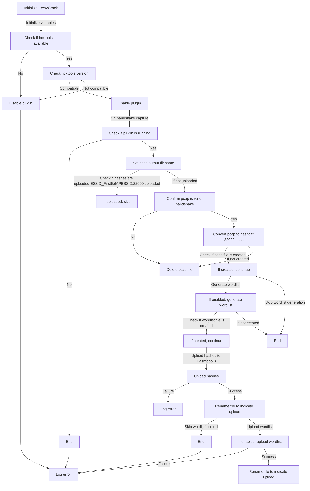

# CG BlueTeamTools

My collection of Bule Team related tools.

```mermaid
graph TD;
A[Initialize Pwn2Crack] -->|Initialize variables| B[Check if hcxtools is available];
B -->|No| E[Disable plugin];
B -->|Yes| C[Check hcxtools version];
C -->|Compatible| D[Enable plugin];
C -->|Not compatible| E[Disable plugin];
D -->|On handshake capture| F[Check if plugin is running];
E --> V[Log error];
F -->|No| X[End];
F -->|Yes| G[Set hash output filename];
G -->|Check if hashes are uploaded,ESSID_First6ofAPBSSID.22000.uploaded| H[If uploaded, skip];
G -->|If not uploaded| I[Confirm pcap is valid handshake];
I -->|No| K[Delete pcap file];
I -->|Yes| J[Convert pcap to hashcat 22000 hash];
J -->|Check if hash file is created| L[If created, continue];
J -->|If not created| K[Delete pcap file];
L -->|Generate wordlist| M[If enabled, generate wordlist];
L -->|Skip wordlist generation| N[End];
M -->|Check if wordlist file is created| O[If created, continue];
M -->|If not created| N[End];
O -->|Upload hashes to Hashtopolis| P[Upload hashes];
P -->|Failure| R[Log error];
P -->|Success| Q[Rename file to indicate upload];
Q -->|Skip wordlist upload| T[End];
Q -->|Upload wordlist| S[If enabled, upload wordlist];
S -->|Failure| V[Log error];
S -->|Success| U[Rename file to indicate upload];
T --> V[Log error];
X --> V[Log error];
```
